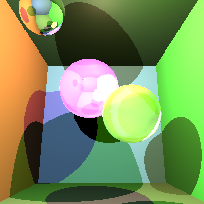

# COMP30019 - Project 1 - Ray Tracer

**Name:** Dylan Cookson-Mleczko \
**Student Number:** 1173182 \
**Username:** dcooksonmlec \
**Email:** dcooksonmlec@student.unimelb.edu.au

## Completed stages

##### Stage 1

- [x] Stage 1.1 - Familiarise yourself with the template
- [X] Stage 1.2 - Implement vector mathematics
- [X] Stage 1.3 - Fire a ray for each pixel
- [X] Stage 1.4 - Calculate ray-entity intersections
- [X] Stage 1.5 - Output primitives as solid colours

##### Stage 2

- [X] Stage 2.1 - Diffuse materials
- [X] Stage 2.2 - Shadow rays
- [X] Stage 2.3 - Reflective materials
- [X] Stage 2.4 - Refractive materials
- [X] Stage 2.5 - The Fresnel effect
- [X] Stage 2.6 - Anti-aliasing

##### Stage 3

- [ ] Option A - Emissive materials (+6)
- [ ] Option B - Ambient lighting/occlusion (+6)
- [ ] Option C - OBJ models (+6)
- [X] Option D - Glossy materials (+3)
- [X] Option E - Custom camera orientation (+3)
- [X] Option F - Beer's law (+3)
- [ ] Option G - Depth of field (+3)

- Option D: Continuously generate random reflections of light off glossy objects via cosine distribution to achieve more realistic glossy reflection than simply applying standard reflection, and add average reflected colour multiplied by 0.5 (fraction acheived via trial-and-error) to colour of glossy object.
- Option E: Employ Rodrigue's rotation formula in order to calculate the new coordinate system.
- Option F: Employ Beer's law in order to calculate the required colour of refractive objects, and additionally add the diffused colour of the refractive object when calculating its colour.

## Final scene render



This render took **10** seconds on my PC.

I used the following command to render the image exactly as shown:

```
dotnet run -- -f tests/final_scene.txt -o images/final_scene.png --cam-pos 0,-0.5,0 --cam-axis 1,0,0 --cam-angle -15
```

## References

- https://en.wikipedia.org/wiki/Rodrigues%27_rotation_formula (custom camera orientation formula)
- https://math.stackexchange.com/questions/13261/how-to-get-a-reflection-vector (reflection vector)
- https://stackoverflow.com/questions/29758545/how-to-find-refraction-vector-from-incoming-vector-and-surface-normal (refraction vector)
- https://en.wikipedia.org/wiki/Fresnel_equations (Fresnel proportion)
- https://stackoverflow.com/questions/15846867/glossy-reflection-in-ray-tracing (glossy reflection)
- https://www.scratchapixel.com/lessons/3d-basic-rendering/ray-tracing-rendering-a-triangle/ray-triangle-intersection-geometric-solution (triangle intersection)
- https://www.scratchapixel.com/lessons/3d-basic-rendering/minimal-ray-tracer-rendering-simple-shapes/ray-sphere-intersection (sphere intersection)